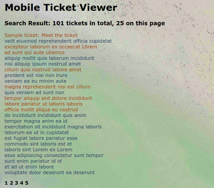
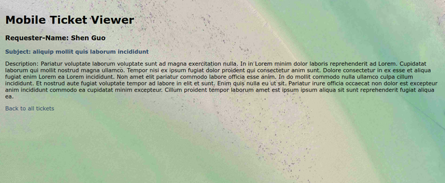

## Zendesk Ticket Viewer

#### Introduction
<pre>

This app allows the user to request the tickets for their account.
The home page displays tickets in a list. Clicking on the individual link will show the individual ticket details on another page.
</pre>
#### Screenshots
    
  

#### How to use the program
<pre>

This app runs under Ruby, my running environment is :
ruby 2.6.2p47 (2019-03-13 revision 67232) [x86_64-linux]  

please see the link below for installation.  
https://www.ruby-lang.org/en/downloads/

Third party libraries required for this app, for Mac/Linux user type in the following cmd line:  
 * gem install Sinatra  
 * gem install logger  
 * gem install minitest
 * gem install httparty  

After installation, the app is ready to run.
Navigate to ticket-viewer folder and type in cmd line:  
rackup  config.ru

open up your browser (Google Chrome Version 74.0.3729.169 (Official Build) (64-bit))
enter URL :
 http://localhost:9292/
now you should be able to use the app.
</pre>
#### About Testing
<pre>
I have tried the unit test using minitest for the ticket data model and getting an API response.

I have done some research on the rack but didn't figure out how to test the pages.

Testing is really important during the whole development process. every time when new feature added, new function abstracted, the test can make sure the changes don't break the whole program.

To run the test navigate to test folder and type in cmd line:
ruby apihelper_test.rb 
or 
ruby ticket_test.rb
</pre>

#### About Authentication
<pre>
first commit using basic authentication, then change to API token which is more secure.
Normally the token should not be exposed, but be hidden using environment variables.
</pre>
#### App Design Structure
<pre>
This app is built using Sinatra framework following MVC design.

config --- API configuration for Authentication

controllers ---  methods and routing for ticket handling

helper --- general methods for API connection and logger (logging all errors occurred in the program)

models --- Ticket data model

views --- client-side views

test --- unit test for data model and API request

main.rb --- app entry point

</pre>

## Challenges

#### Connecting to Zendesk API with Authentication
<pre>
This is taking much longer than I expected. A lot of time was spent on reading the documentation and abstracting useful information.
</pre>
#### Structure design for the whole app.

<pre>
Good design comes with practice and deep thinking. I am not familiar with the rails framework, therefore this app is built on Sinatra but the design pattern of rails inspired me when using Sinatra to build the app.
</pre>

